# 🛍️ Edible Arrangements AI-Driven E-commerce Platform

## Overview

A comprehensive Supabase-powered e-commerce platform for Edible Arrangements featuring AI chatbot integration, dual-optimized database architecture, and enterprise-grade security.

## 🏗️ Architecture

- **Database**: 21-table structure (17 normalized + 4 AI-optimized flat tables)
- **Edge Functions**: 4 production-ready APIs for all operations
- **Security**: Row-level security with intelligent rate limiting
- **AI Integration**: Optimized for voice assistants and chatbots

### Database Architecture Overview

```mermaid
graph TB
    subgraph "🛍️ Products & Catalog (7 tables)"
        P[products] --> PO[product_options]
        P --> PI[product_ingredients]
        P --> PC[product_categories]
        PI --> I[ingredients]
        PC --> C[categories]
        A[addons]
    end
    
    subgraph "👥 Customers & Addresses (3 tables)"
        CU[customers] --> CA[customer_addresses]
        CU --> RA[recipient_addresses]
    end
    
    subgraph "📦 Orders (4 tables)"
        O[orders] --> OI[order_items]
        O --> OSH[order_status_history]
        OI --> OA[order_addons]
    end
    
    subgraph "🏪 Business (3 tables)"
        F[franchisees] --> INV[inventory]
        ARL[api_rate_limits]
    end
    
    subgraph "🤖 AI-Optimized Flat Tables (4 tables)"
        CPF[chatbot_products_flat]
        CCF[chatbot_customers_flat]
        COF[chatbot_orders_flat]
        CFF[chatbot_franchisees_flat]
    end
    
    %% Key Relationships
    CU --> O
    F --> O
    P --> OI
    P --> INV
    RA --> O
    A --> OA
    
    %% AI Sync (automatic triggers)
    P -.-> CPF
    CU -.-> CCF
    O -.-> COF
    F -.-> CFF
    
    style CPF fill:#e1f5fe
    style CCF fill:#e1f5fe
    style COF fill:#e1f5fe
    style CFF fill:#e1f5fe
```

## 📚 Documentation Structure

### Core System Documentation
- **[DATABASE_STRUCTURE.md](DATABASE_STRUCTURE.md)** - Complete database schema, tables, and relationships
- **[EDGE_FUNCTIONS_GUIDE.md](EDGE_FUNCTIONS_GUIDE.md)** - API endpoints and integration details
- **[SECURITY_GUIDE.md](SECURITY_GUIDE.md)** - Security policies and rate limiting

### Integration Guides
- **[AI_AGENT_INTEGRATION.md](AI_AGENT_INTEGRATION.md)** - How to integrate AI agents and chatbots
- **[CUSTOMER_MANAGEMENT.md](CUSTOMER_MANAGEMENT.md)** - Account management and conflict resolution

### Configuration & Credentials
- **[SUPABASE_SETUP.md](SUPABASE_SETUP.md)** - Project credentials and connection details

### Implementation History
- **[MOTHERS_DAY_IMPORT.md](MOTHERS_DAY_IMPORT.md)** - Real product data import example

### Documentation Navigation Flow

```mermaid
flowchart TD
    START([👋 Start Here: README.md]) --> DB{Need Database Understanding?}
    
    DB -->|Yes| DBD[📊 DATABASE_STRUCTURE.md<br/>Complete Schema Reference]
    DB -->|No| SETUP[🔧 SUPABASE_SETUP.md<br/>Get Connected]
    
    DBD --> SETUP
    
    SETUP --> APIS[🚀 EDGE_FUNCTIONS_GUIDE.md<br/>Learn the 4 APIs]
    
    APIS --> GOAL{What's Your Goal?}
    
    GOAL -->|Build AI Chatbot| AI[🤖 AI_AGENT_INTEGRATION.md<br/>Voice Assistant Integration]
    GOAL -->|Handle Accounts| CUST[👥 CUSTOMER_MANAGEMENT.md<br/>Account Conflict Resolution]
    GOAL -->|Production Deploy| SEC[🔒 SECURITY_GUIDE.md<br/>Enterprise Security]
    GOAL -->|Import Data| IMP[📊 MOTHERS_DAY_IMPORT.md<br/>Real Data Import Example]
    
    AI --> PROD{Ready for Production?}
    CUST --> PROD
    IMP --> PROD
    
    PROD -->|Yes| SEC
    PROD -->|No| APIS
    
    SEC --> DONE([🎉 Production Ready!])
    
    style START fill:#e8f5e8
    style DONE fill:#e8f5e8
    style DB fill:#fff3e0
    style GOAL fill:#fff3e0
    style PROD fill:#fff3e0
```

---

## 🚀 Quick Start

1. **Database Connection**: See [SUPABASE_SETUP.md](SUPABASE_SETUP.md) for credentials
2. **API Integration**: Check [EDGE_FUNCTIONS_GUIDE.md](EDGE_FUNCTIONS_GUIDE.md) for endpoints
3. **AI Agent Setup**: Follow [AI_AGENT_INTEGRATION.md](AI_AGENT_INTEGRATION.md) for chatbot integration

## 💼 Production Ready

✅ **Fully Deployed**: All systems tested and operational  
✅ **Enterprise Security**: RLS policies and rate limiting active  
✅ **AI Optimized**: Flat tables for single-query chatbot operations  
✅ **Sample Data**: Products, customers, and orders ready for testing

---

## 🗄️ Database Architecture Reference

For a complete understanding of the Supabase database structure, including all 21 tables, relationships, and AI optimization strategies, see **[DATABASE_STRUCTURE.md](DATABASE_STRUCTURE.md)**.

This document covers:
- **Normalized Tables** (17): Products, customers, orders, and business logic
- **AI-Optimized Flat Tables** (4): JSONB structures for single-query chatbot operations  
- **Automatic Synchronization**: Triggers that keep flat tables updated
- **Security Policies**: Row-level security implementation
- **Sample Data**: Pre-loaded products and test scenarios

*Start with [DATABASE_STRUCTURE.md](DATABASE_STRUCTURE.md) for complete technical documentation*