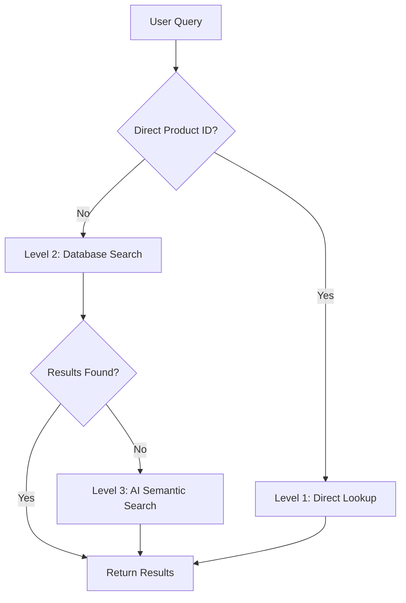

# Technical Architecture

This document provides a detailed breakdown of the technical architecture for the Edible Arrangements AI agent project.

## 1. Frontend Architecture

-   **Framework:** [Next.js](https://nextjs.org/) (React)
-   **Styling:** [Tailwind CSS](https://tailwindcss.com/)
-   **UI Components:** Built using a combination of custom components and primitives from [shadcn/ui](https://ui.shadcn.com/).
-   **State Management:** Primarily managed via React hooks (`useState`, `useContext`) and component state. For global state, especially for the chatbot and user session, React's Context API is utilized.
-   **Key Directories:**
    -   `src/app/`: Main application routes and page components.
    -   `src/components/`: Reusable UI components (e.g., `Header`, `ChatPanel`).
    -   `src/lib/`: Utility functions, type definitions (`types.ts`), and client-side API interaction logic.
    -   `src/styles/`: Global CSS styles.

## 2. Backend Architecture (Supabase)

The backend is fully hosted on Supabase and leverages its integrated services.

### 2.1. Edge Functions

These are Deno-based TypeScript functions that contain the core business logic. They are located in the `supabase/functions/` directory.

-   **`product-search`**: Handles semantic search queries for products using vector embeddings.
-   **`customer-management`**: Manages customer data. It can find existing customers (by phone, email, or auth ID) or create new ones, intelligently merging data from different sources.
-   **`franchisee-inventory`**: Finds the nearest franchisee based on a ZIP code and checks for product availability.
-   **`order`**: Orchestrates the creation and retrieval of entire orders. It handles generating order numbers, calculating totals, and managing fulfillment details. Supports `GET`, `POST`, and `PATCH`.
-   **`order-items`**: A powerful function for modifying the contents of an existing order. It supports adding, updating, and removing items, with advanced logic for handling product options and preventing accidental order cancellations. Supports `PATCH`.
-   **`cart-manager`**: Provides a stateful cart API for the frontend, allowing for the creation of carts and the addition/removal of items before an order is formally created.
-   **`user-profile`**: Handles profile data for authenticated web app users, allowing them to view and update their personal information.
-   **`generate-embedding`**: A utility function used to convert product descriptions and other text into vector embeddings for semantic search.

### 2.2. Database (PostgreSQL)

The database schema is designed to be both normalized for data integrity and denormalized for performance, especially for the AI agent's needs.

-   **Core Tables:**
    -   `products`: Contains all product information.
    -   `product_options`: Different variations of a product (e.g., Small, Large).
    -   `customers`: Stores all customer information, linked to `auth.users` for authenticated sessions.
    -   `franchisees`: Information about each store location.
    -   `inventory`: Tracks product stock at each franchisee.
    -   `orders`: The main orders table, containing high-level information.
    -   `order_items`: Line items for each order, linked to products and options.
    -   `carts` & `cart_items`: Manages pre-order shopping carts.

-   **"Flat" Tables for AI:**
    -   To provide the AI agent with fast, comprehensive data, several "flat" tables are maintained using database triggers. These tables contain denormalized JSON blobs of related data.
    -   `chatbot_orders_flat`: Contains a complete snapshot of an order, including all items, customer info, and delivery details in a single row. This avoids complex joins when the chatbot needs to retrieve order status.
    -   `chatbot_customers_flat`: Similar to the above, but for customer data.
    -   `chatbot_franchisees_flat`: Contains denormalized franchisee data.

## 3. Integrations

-   **Voiceflow:** The primary tool for designing the conversational flow of the AI agent. The frontend communicates with Voiceflow, which in turn calls the Supabase Edge Functions to perform actions and retrieve data. The API contracts for these interactions are documented in:
    -   `docs/voiceflow-order-modification-api.md`
    -   `docs/voiceflow-button-handling-guide.md`
-   **OpenAI:** Used by Voiceflow and the `generate-embedding` function for its powerful language models.
-   **VAPI:** Manages the telephony layer, connecting phone calls to the Voiceflow agent.

# Edible Arrangements Voiceflow Integration Architecture

## System Overview

This system provides a complete backend infrastructure for an Edible Arrangements chatbot built with Voiceflow. The architecture consists of a Supabase PostgreSQL database with specialized edge functions for product search, order management, and customer handling.

## Core Components

### 1. Database Schema (PostgreSQL + Supabase)

#### Product Management
- **products**: Core product catalog with 4-digit customer-friendly identifiers
  - Supports both UUID (internal) and 4-digit ID (customer-facing)
  - Vector embeddings for semantic search capabilities
  - Base pricing and product information

- **product_options**: Variant pricing and configurations
  - Human-readable option names (e.g., "Large", "Birthday")
  - Absolute pricing (not modifiers)
  - Availability tracking per option

- **addons**: Universal add-ons like greeting cards and balloons
- **ingredients**: Allergen tracking and safety system
- **categories**: Occasion and seasonal categorization

#### Customer System
- **customers**: Unified customer profiles across all channels
  - Multi-source account management (chatbot, web, phone)
  - Allergy and dietary preference tracking
  - Account deduplication logic

- **customer_addresses**: Personal address book
- **recipient_addresses**: Gift delivery destinations

#### Order Management
- **orders**: Main order records with unique order numbers
  - Format: `W[store_number][sequence]-1` (e.g., `W25710000001-1`)
  - Support for both delivery and pickup
  - Real-time pricing with 8.25% tax

- **order_items**: Line items with quantity and pricing
- **order_addons**: Additional items per line item
- **order_status_history**: Complete order lifecycle tracking

#### Store Operations
- **franchisees**: Store locations and operating information
- **delivery_zones**: ZIP code coverage and delivery rules
- **inventory**: Real-time stock tracking per store
- **seasonal_availability**: Product seasonality management

#### Performance Optimization
- **chatbot_*_flat**: Denormalized JSONB tables for single-query chatbot operations
  - Automatically synchronized via database triggers
  - Optimized for conversational interfaces
  - Minimal API response payloads

### 2. Edge Functions (Serverless APIs)

#### Current Deployed Functions

**product-search (v14)**
- Multi-tier search strategy for product discovery
- Level 1: Direct 4-digit product ID lookup
- Level 2: Structured database filtering 
- Level 3: AI semantic search using OpenAI embeddings
- Real-time inventory checking and allergen warnings

**customer-management (v4)**
- Account creation and unification
- Duplicate detection and prevention
- Address management and validation
- Preference and allergy tracking

**franchisee-inventory (v8)**
- ZIP code-based store finding
- Operating hours and delivery zone validation
- Real-time inventory status
- Store capacity and availability

**order (v16)**
- Complete order creation and management
- Automatic order number generation
- Real-time pricing calculations with tax
- Address validation and delivery logistics

**order-items (v9)**
- Advanced order modification capabilities
- Smart ADD: Prevents duplicates, updates quantities
- Partial REMOVE: Supports quantity-based removal
- Cancellation prevention with live agent handoff
- Real-time total recalculation

**generate-embedding (v5)**
- OpenAI integration for product embeddings
- Semantic search vector generation
- Batch processing capabilities

### 3. AI Integration

#### Semantic Search
- OpenAI `text-embedding-ada-002` model
- 1536-dimension vectors stored in PostgreSQL
- Cosine similarity search with HNSW indexing
- Fallback strategy for query refinement

#### Conversational Interface
- Voiceflow-optimized response formats
- Voice-friendly error messages
- Context-aware product recommendations
- Natural language query processing

## Business Logic

### Product Identification
- **4-digit Product IDs**: Easy voice communication (e.g., "3075")
- **Option Names**: Human-readable ("Large", "Birthday")
- **Price Structure**: Base price + option price (not additive)

### Order Numbers
- **Format**: `W[store_number][8-digit-sequence]-1`
- **Purpose**: Phone-friendly reference numbers
- **Generation**: Automatic, globally unique sequence

### Pricing System
- **Base Prices**: Product starting price
- **Option Prices**: Complete price replacement
- **Addons**: Additional charges
- **Tax Rate**: 8.25% applied at checkout
- **Precision**: All calculations use DECIMAL(10,2)

### Customer Experience
- **Voice Optimization**: All APIs designed for conversational flow
- **Error Handling**: User-friendly messages with helpful suggestions
- **Allergy Safety**: Automatic ingredient checking and warnings
- **Cancellation Prevention**: Complex scenarios redirect to live agents

## Data Flow

### Order Creation Process
1. Customer provides product request (voice/text)
2. Product search with multi-tier strategy
3. Inventory check at selected store
4. Customer and address validation
5. Order creation with automatic numbering
6. Real-time total calculation with tax

### Order Modification Process
1. Order lookup by order number
2. Smart item addition (duplicate prevention)
3. Partial quantity removal support
4. Cancellation detection and prevention
5. Live agent handoff for complex scenarios

### Search Strategy

## Security & Performance

### Rate Limiting
- **IP-based**: Different limits per endpoint type
- **Automatic Cleanup**: Expired limits removed automatically
- **Protection**: Prevents abuse while allowing normal usage

### Data Security
- **Row Level Security**: All tables protected with RLS policies
- **Input Validation**: Comprehensive sanitization and validation
- **Service Role**: Edge functions use service-level authentication

### Performance Optimization
- **Flat Tables**: Single-query operations for chatbots
- **Vector Indexing**: Efficient semantic search
- **Minimal Payloads**: Streamlined API responses
- **Database Triggers**: Automatic cache invalidation

## Integration Points

### Voiceflow Connection
- **RESTful APIs**: Standard HTTP/JSON communication
- **Error Handling**: Structured error responses with user messages
- **Context Preservation**: Stateless operations with context passing
- **Voice Optimization**: Response formats suitable for TTS

### Store Systems
- **Inventory Sync**: Real-time stock status
- **Order Export**: Integration-ready order formats
- **Status Updates**: Bidirectional order status communication

## Deployment Architecture

### Supabase Infrastructure
- **Database**: PostgreSQL with extensions (pgvector, uuid-ossp)
- **Edge Functions**: Deno-based serverless functions
- **Authentication**: Service role for internal operations
- **Storage**: Product images and assets

### External Dependencies
- **OpenAI API**: Embedding generation and semantic search
- **Voiceflow**: Chatbot interface and conversation management

## Monitoring & Maintenance

### Data Integrity
- **Foreign Key Constraints**: Referential integrity enforcement
- **Check Constraints**: Data validation at database level
- **Automatic Triggers**: Flat table synchronization
- **Unique Constraints**: Duplicate prevention

### Performance Monitoring
- **Query Performance**: Optimized indexes for common operations
- **Response Times**: Sub-second API response targets
- **Error Tracking**: Comprehensive logging and error handling

This architecture provides a robust, scalable foundation for conversational commerce while maintaining data integrity and optimal performance for voice-based interactions. 