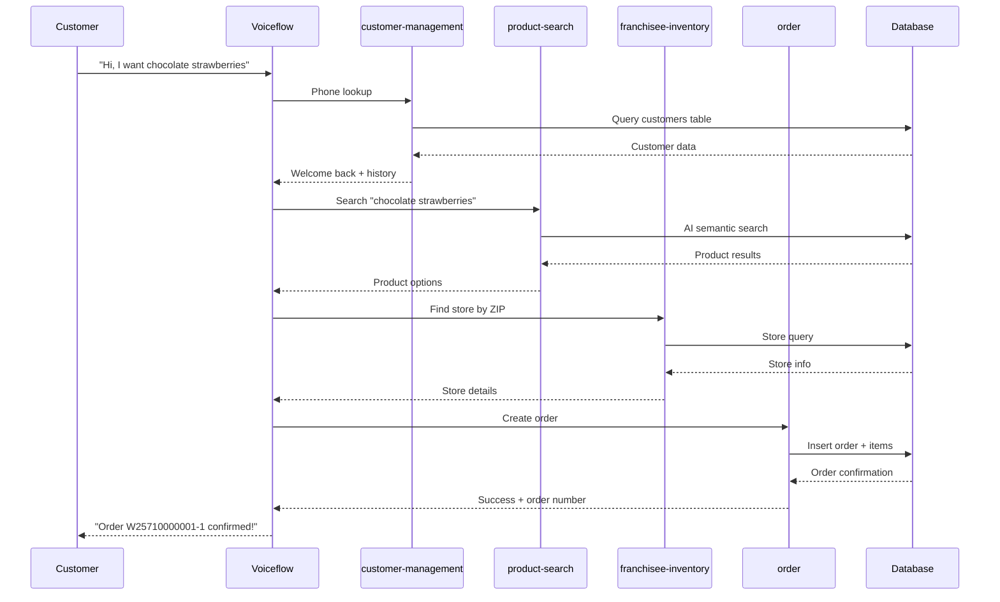
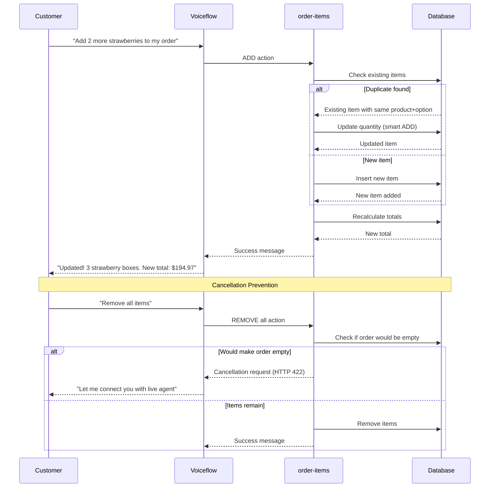
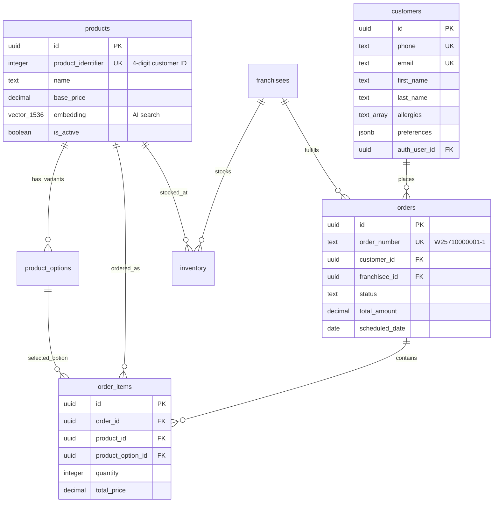

# System Overview

Complete overview of the Edible Arrangements Voiceflow integration system architecture and data flow.

## Architecture Diagram

```mermaid
graph TB
    subgraph "External Integrations"
        VF[Voiceflow Chatbot]
        WEB[Web Application]
        PHONE[Phone Orders]
        OAI[OpenAI API]
    end

    subgraph "API Layer (Edge Functions)"
        PS[product-search v14]
        CM[customer-management v4]
        FI[franchisee-inventory v8]
        ORD[order v16]
        OI[order-items v9]
        GE[generate-embedding v5]
    end

    subgraph "Supabase Database"
        subgraph "Normalized Tables (17)"
            PROD[products]
            PRODOPT[product_options]
            CUST[customers]
            ORDERS[orders]
            ORDERITEMS[order_items]
            FRAN[franchisees]
            INV[inventory]
        end

        subgraph "Flat Tables (4)"
            CHATPROD[chatbot_products_flat]
            CHATCUST[chatbot_customers_flat]
            CHATORD[chatbot_orders_flat]
            CHATFRAN[chatbot_franchisees_flat]
        end

        subgraph "AI Features"
            EMBED[Vector Embeddings]
            SEARCH[Semantic Search]
        end
    end

    %% External to API connections
    VF --> PS
    VF --> CM
    VF --> FI
    VF --> ORD
    VF --> OI
    WEB --> CM
    WEB --> ORD
    PHONE --> CM
    PHONE --> ORD

    %% API to database connections
    PS --> PROD
    PS --> CHATPROD
    PS --> EMBED
    PS --> OAI
    CM --> CUST
    CM --> CHATCUST
    FI --> FRAN
    FI --> INV
    FI --> CHATFRAN
    ORD --> ORDERS
    ORD --> ORDERITEMS
    ORD --> CHATORD
    OI --> ORDERITEMS
    OI --> CHATORD
    GE --> OAI
    GE --> EMBED

    %% Trigger synchronization
    PROD -.-> CHATPROD
    CUST -.-> CHATCUST
    ORDERS -.-> CHATORD
    FRAN -.-> CHATFRAN

    style VF fill:#4CAF50
    style PS fill:#2196F3
    style CM fill:#2196F3
    style FI fill:#2196F3
    style ORD fill:#2196F3
    style OI fill:#2196F3
    style GE fill:#2196F3
    style CHATPROD fill:#FF9800
    style CHATCUST fill:#FF9800
    style CHATORD fill:#FF9800
    style CHATFRAN fill:#FF9800
```

## Data Flow Patterns

### Customer Journey Flow

### Order Modification Flow

## Database Schema Overview

### Core Entity Relationships

## System Capabilities

### Current Features (Production Ready)
- ✅ **Customer Management**: Multi-platform account unification
- ✅ **AI Product Search**: 3-tier search with OpenAI embeddings
- ✅ **Store Management**: ZIP-based store finding with inventory
- ✅ **Order Creation**: Complete order processing with tax calculation
- ✅ **Smart Order Modification**: Add/remove items with duplicate prevention
- ✅ **Cancellation Prevention**: Live agent handoff for complex scenarios
- ✅ **Voice Optimization**: Conversational responses for TTS
- ✅ **Rate Limiting**: API protection with automatic cleanup
- ✅ **Real-time Sync**: Flat tables for optimal chatbot performance

### Performance Metrics
- **API Response Time**: < 500ms for most operations
- **Search Accuracy**: 3-tier fallback ensures results
- **Database Efficiency**: Single-query flat table operations
- **Rate Limits**: Balanced protection without blocking normal usage

### Security Features
- **Row Level Security**: All tables protected with RLS policies
- **Input Validation**: Comprehensive sanitization and validation
- **Service Authentication**: Edge functions use service role
- **Audit Trails**: Complete operation logging

## Integration Points

### Voiceflow Chatbot
- **Primary Channel**: Voice and text interactions
- **API Integration**: RESTful calls to edge functions
- **Context Management**: Stateless operations with variable preservation
- **Error Handling**: Conversational error recovery

### Web Application
- **Customer Portal**: Account management and ordering
- **Authentication**: Supabase Auth integration
- **Real-time Updates**: Live order status tracking

### Store Operations
- **Inventory Management**: Real-time stock tracking
- **Order Processing**: Automated order routing
- **Delivery Coordination**: ZIP code-based service areas

## Deployment Architecture

### Supabase Infrastructure
- **Database**: PostgreSQL with pgvector and uuid-ossp extensions
- **Edge Functions**: 6 active functions handling all operations
- **Authentication**: Row-level security with service roles
- **Storage**: Product images and static assets

### External Dependencies
- **OpenAI**: Embedding generation for semantic search
- **Voiceflow**: Conversation management and NLU

## Monitoring & Maintenance

### Health Monitoring
- **API Rate Limits**: Automatic tracking and cleanup
- **Database Performance**: Query optimization and indexing
- **Error Tracking**: Comprehensive logging across all functions
- **Trigger Synchronization**: Flat table consistency monitoring

### Data Integrity
- **Foreign Key Constraints**: Referential integrity enforcement
- **Check Constraints**: Data validation at database level
- **Unique Constraints**: Duplicate prevention
- **Automatic Triggers**: Real-time flat table updates

This system provides a complete, production-ready backend for conversational commerce with Edible Arrangements, optimized for voice interactions while maintaining data integrity and performance. 